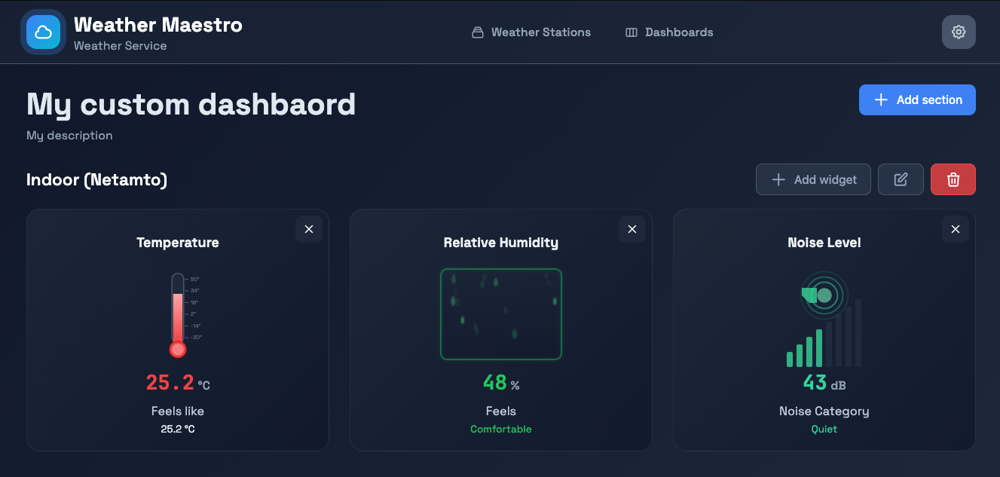
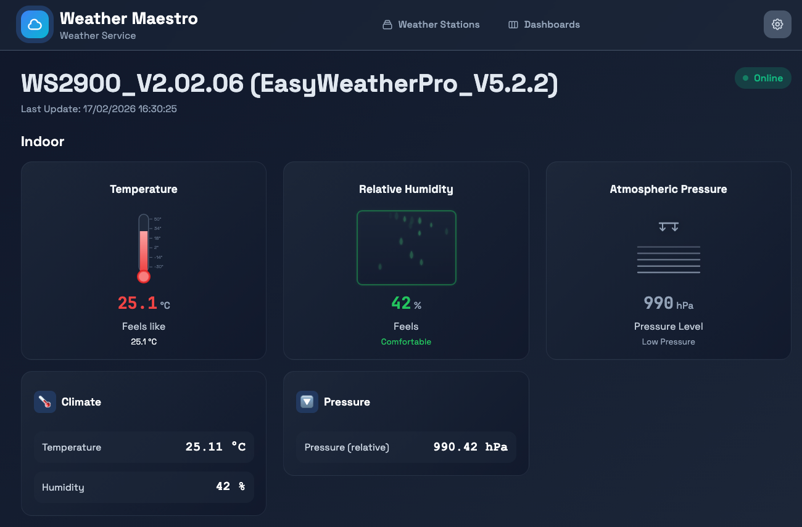
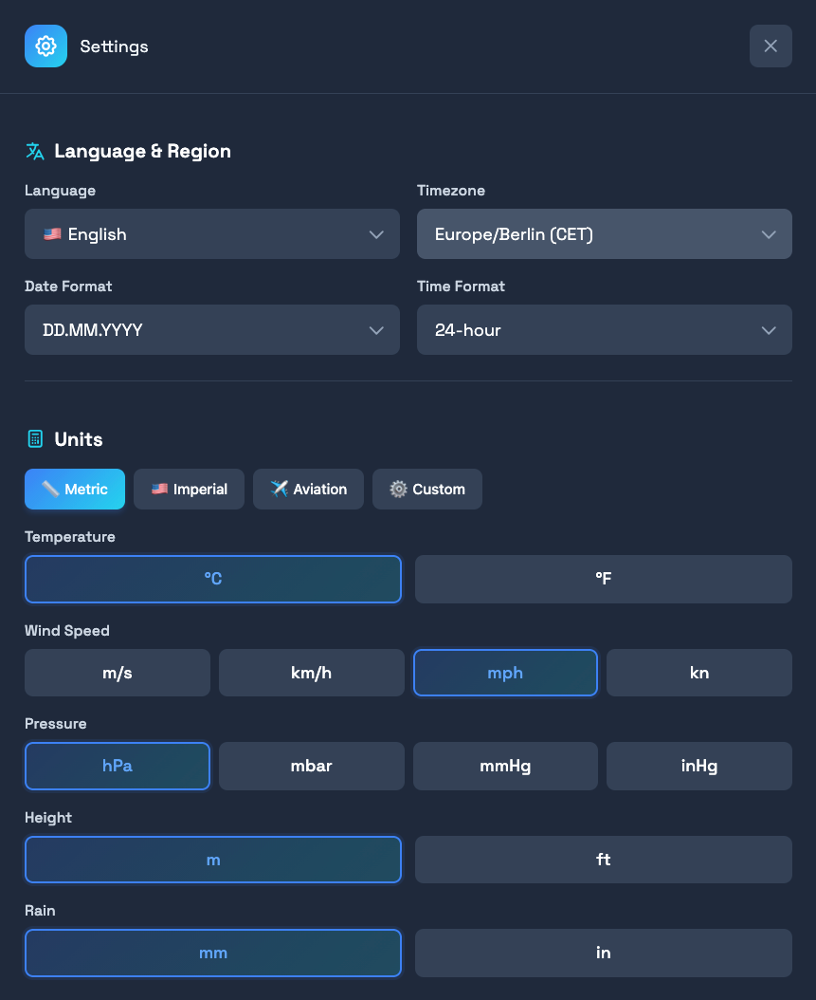

# WeatherMaestro UI

A modern, responsive web interface for the [WeatherMaestro](https://github.com/sguter90/weathermaestro) weather data platform.

## Overview

WeatherMaestro is a self-hosted alternative to [Weathercloud](https://weathercloud.net/en) or [Weather Underground](https://www.wunderground.com/).

This is the WeatherMaestro UI - a modern dashboard for real-time weather station monitoring.  
Visualize data from multiple weather stations, create custom dashboards, and manage your weather data with an intuitive interface.

Built with [Lit](https://lit.dev/) web components and [Vite](https://vitejs.dev/).

**Features:**
- 🗺️ Support for multiple weather stations
- 🌍 Internationalization (German & English)
- 🎨 Modern, responsive UI design
- 📏 Flexible unit system (°C/°F, km/h/mph, hPa/inHg, etc.)
- 📊 Create custom dashboards combining data from multiple weather stations
- 🔐 Authentication with weather maestro backend
- 📱 Mobile-friendly interface
- 🐳 Docker support for easy deployment

## Roadmap

- [ ] Advanced data visualization and charts
- [ ] PWA support
## Screenshots
| Dashboard                                                                    | Station                                                                 | Settings                                                                  |
|------------------------------------------------------------------------------|-------------------------------------------------------------------------|---------------------------------------------------------------------------|
| [](docs/screenshot-dashboard.png) | [](docs/screenshot-station.png) | [](docs/screenshot-settings.png) |

## Prerequisites

- Node.js 22+ and npm
- WeatherMaestro backend API running (see [sguter90/weathermaestro](https://github.com/sguter90/weathermaestro))

## Installation

### Docker Compose (recommended)
Please have a look at the [sguter90/weathermaestro README](https://github.com/sguter90/weathermaestro#installation).  
There you will also find a [docker-compose file](https://github.com/sguter90/weathermaestro/blob/main/deployments/docker/compose.prod.yml) including backend, database and ui. 

### Local Development

1. **Clone the repository:**
   ```bash
   git clone https://github.com/sguter90/weathermaestro-ui.git
   cd weathermaestro-ui
   ```

2. **Install dependencies:**
   ```bash
   npm install
   ```

3. **Configure environment variables:**
   Create a `.env.local` file in the root directory to set correct weather maestro backend URL:
   ```env
   VITE_API_BASE_URL=http://localhost:8080
   ```

4. **Start the development server:**
   ```bash
   npm run dev
   ```

   The application will be available at `http://localhost:5173`

### Production Build

```bash
npm run build
```

This creates an optimized production build in the `dist/` directory.

## Technology Stack

- [Vite](https://vitejs.dev/) - Next generation frontend tooling
- [Lit](https://lit.dev/) - Lightweight web components library
- [lit-html](https://lit.dev/docs/templates/overview/) - HTML templating

## Contributing
Contributions are welcome! Please follow these steps:
1. Fork the repository
2. Create a feature branch (git checkout -b feature/amazing-feature)
3. Commit your changes (git commit -m 'Add amazing feature')
4. Push to the branch (git push origin feature/amazing-feature)
5. Open a Pull Request

## License

This project is licensed under the MIT License - see the LICENSE file for details.

## Related Projects

- [WeatherMaestro Backend](https://github.com/sguter90/weathermaestro) - Go backend API
- [Vite](https://vitejs.dev/) - Next generation frontend tooling
- [Lit](https://lit.dev/) - Lightweight web components library
- [lit-html](https://lit.dev/docs/templates/overview/) - HTML templating

## Support

For issues, questions, or suggestions, please open an issue on the [GitHub repository](https://github.com/sguter90/weathermaestro-ui/issues).
